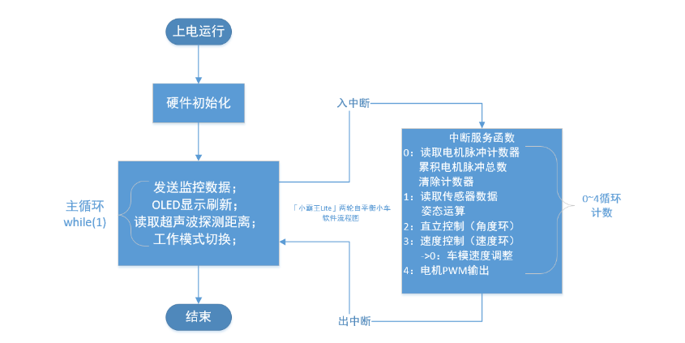
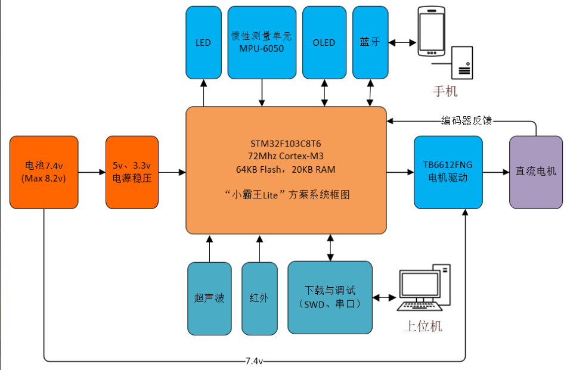
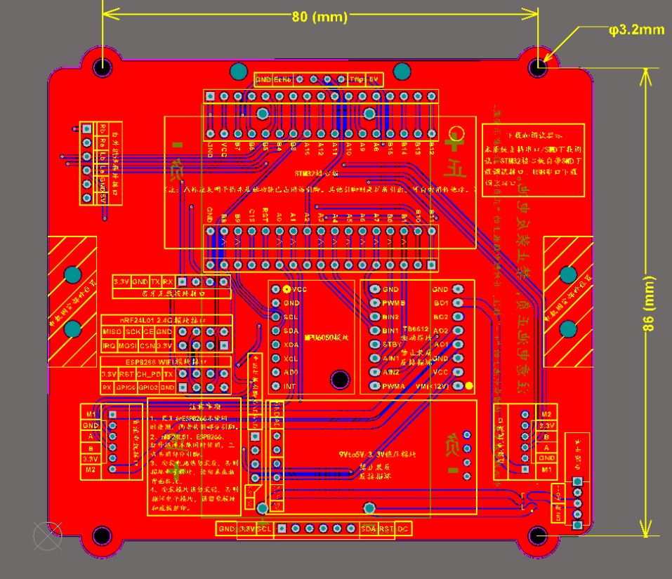
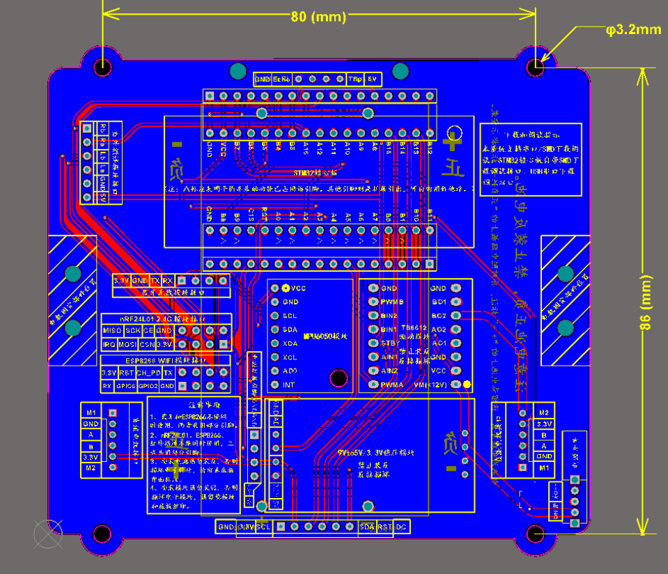

# balanced_car_pid  二轮PID平衡小车开源
## 视频演示
(https://www.bilibili.com/video/BV1qu4y1Q7eD/?spm_id_from=333.999.0.0&vd_source=f7f8594f54539bd9ff4339d9ad62f47c)

## 软件流程图

## 硬件系统框图

## PCB正面

## PCB反面

